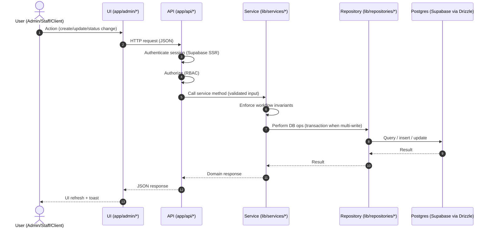
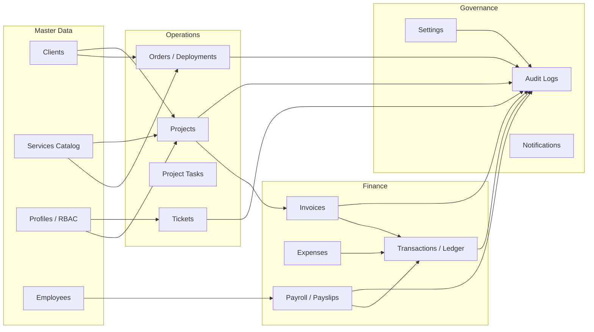
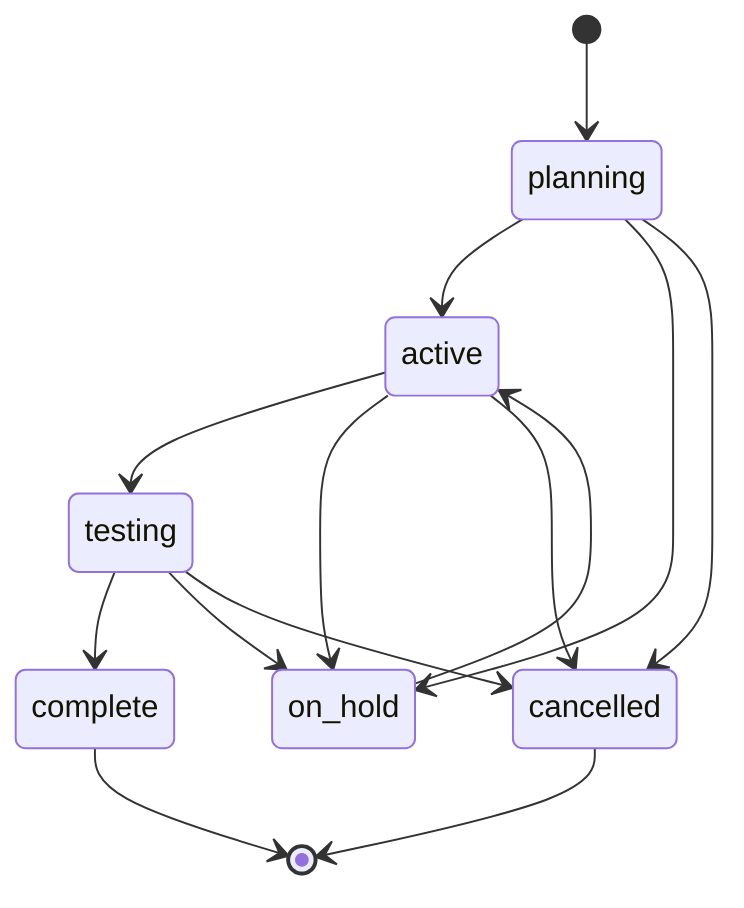
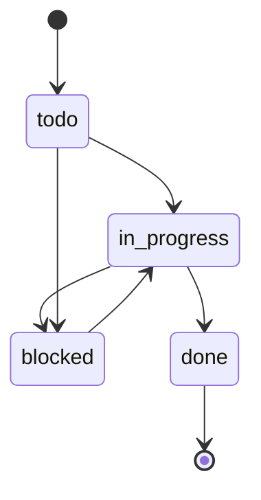
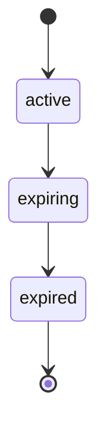
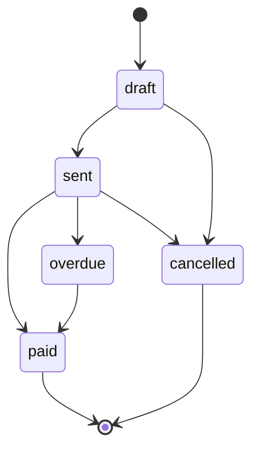
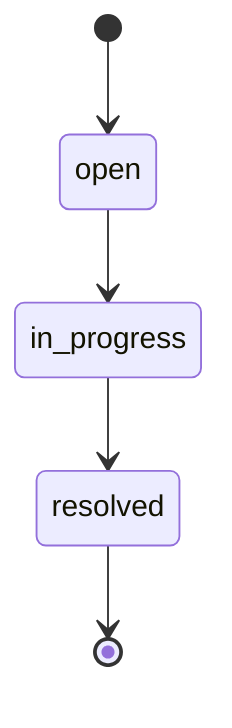

# Innovate Bhutan ERP — End-to-End Flows (Canonical)

This document defines the **end-to-end ERP flows** across UI → API → Service → Repository → DB, including **state machines**, **cross-module handoffs**, and **must-hold invariants**.

If implementation diverges, **fix code to match these flows** unless you explicitly update this doc *and* `PROJECT_BRAIN.md`.

## Global ERP request flow (applies to every module)

### Non-negotiables (every flow)
- **AuthN**: API routes validate session; UI middleware is not sufficient.
- **AuthZ**: RBAC enforced in services (and optionally in API middleware).
- **Validation**: all API inputs validated with Zod (`lib/validations/*`).
- **Audit logging**: all mutations write `audit_logs` (who/what/when + before/after where feasible).
- **Atomicity**: any multi-write operation uses a DB transaction.
- **Consistent errors**: canonical error format and status codes (4xx for client errors, 5xx for server errors).

## ERP “spine” (master data → operations → finance → governance)

## Identity & Access (profiles + Supabase Auth)

### Core flows
- **Sign in**: User authenticates via Supabase Auth → session established → `/admin/*` accessible.
- **Profile binding**: `profiles.user_id` links to Auth user; `profiles.role ∈ {ADMIN, STAFF, CLIENT}` drives RBAC.

### Invariants
- **Every authenticated ERP user must have exactly one `profiles` row**.
- **Role changes must be audited** (operator, before/after).

## Clients (partner/customer master data)

### Create / update client
1. UI: `/admin/clients` create/edit form.
2. API: `POST /api/clients` or `PATCH/PUT /api/clients/[id]` (if present).
3. Service validates:
   - uniqueness constraints (e.g., name/phone if enforced)
   - normalization (phone format, optional fields)
4. Repo writes `clients` row.
5. Audit log: `CLIENT_CREATED` / `CLIENT_UPDATED`.

### Invariants
- Client must be created before any downstream entity that references it (Projects, AMC, Invoices, Tickets).

## Services (service catalog)

### Create / update service
1. UI: `/admin/services` create/edit.
2. API: `POST /api/services` or `PATCH/PUT /api/services/[id]` (if present).
3. Service validates:
   - name/category required
   - pricing rules (non-negative)
4. Repo writes `services`.
5. Audit log: `SERVICE_CREATED` / `SERVICE_UPDATED`.

### Invariants
- Services referenced by Projects/Orders/AMCs must remain stable; prefer **soft delete** over hard delete.

## Projects (projects + project_tasks)

### State machines

**Project status**

**Task status**

### Create project
1. UI: `/admin/projects` → “Create project” modal.
2. API: `POST /api/projects`.
3. Service:
   - validates `clientId`, `serviceId`, `leadId` (if used), required metadata
   - initializes `status = planning`
   - sets `progress = 0` (cached)
4. Repo inserts `projects`.
5. Audit log: `PROJECT_CREATED`.

### Manage tasks (drives progress)
1. UI: project detail modal → add/update task.
2. API:
   - `POST /api/projects/[id]/tasks` to add task
   - `PUT/PATCH /api/tasks/[taskId]` to update status/assignment
3. Service:
   - validates status transition rules
   - recomputes project progress using DB aggregation
   - when attempting to complete a project: blocks if any task not `done`
4. Repo: transactional update (task write + progress update).
5. Audit log: `TASK_CREATED` / `TASK_UPDATED` and `PROJECT_PROGRESS_UPDATED`.

### Invariants (must always hold)
- `projects.progress` is **derived** from tasks (cached 0–100).
- Completing project requires **no incomplete tasks**.
- Multi-write operations are **atomic** (task changes + progress recalculation).

## AMC (Annual Maintenance Contracts)

### AMC lifecycle

### Create AMC
1. UI: `/admin/amc` create contract.
2. API: `POST /api/amc`.
3. Service validates:
   - `clientId`, `serviceId`
   - date range (`startDate < endDate`)
   - amount fields
4. Repo inserts `amcs` with `status = active`.
5. Audit log: `AMC_CREATED`.

### Renewal flow (must be atomic)
1. UI: choose AMC → “Renew”.
2. API: `POST /api/amc/[id]/renew`.
3. Service:
   - verifies AMC is eligible for renewal
   - creates a **new AMC** row with new dates/amount
   - links chain fields (`renewed_from`, `renewed_to`)
   - updates old AMC as needed
4. Repo: transaction across **all writes** (new AMC + link updates).
5. Audit log: `AMC_RENEWED`.

### Invariants
- Renewal chain cannot be corrupted (no forks, no orphans).
- “Expiring soon” is computed from date and surfaced in UI; notifications are a future enhancement but **flow assumes it exists**.

## Invoices (billing)

### Invoice lifecycle

### Create invoice (from project or standalone)
1. UI: `/admin/invoice` create invoice (optionally from a project).
2. API: `POST /api/invoices`.
3. Service:
   - validates `clientId` exists
   - validates line items (`items`) and totals
   - generates `invoice_number` using collision-safe strategy (DB-unique)
   - sets `status = draft`
4. Repo: insert invoice.
5. Audit log: `INVOICE_CREATED`.

### Send / mark paid / cancel
1. UI changes status.
2. API: `PATCH /api/invoices/[id]/status`.
3. Service enforces allowed transitions and records timestamps (`sentAt`, `paidAt`, `cancelledAt` if present).
4. Repo updates invoice.
5. Audit log: `INVOICE_STATUS_CHANGED`.

### Finance handoff (invoice → transactions)
When invoice becomes `paid`:
- Service writes a corresponding **income** entry in `transactions` (or queues it for reconciliation if you support pending).
- This must be in the **same transaction** as the invoice status update (or be idempotent with a unique linkage key).

### Invariants
- `invoice_number` must be unique, collision-safe, and not trivially predictable.
- UI must **never** write invoices directly to DB; it must go through API → Service.

## Finance (ledger + OCR ingestion)

### OCR ingestion → reviewable transactions
1. UI: `/admin/finance` upload statement/receipt.
2. API: `POST /api/ocr`.
3. Service:
   - runs OCR/AI extraction
   - creates `transactions` rows as **pending** (recommended) or `complete` if high confidence
   - attaches raw OCR payload metadata (if stored) for auditability
4. Audit log: `TRANSACTION_IMPORTED`.
5. UI: user reviews pending items → confirms or edits → marks `complete`.

### Manual transaction entry
1. UI: add transaction.
2. API: `POST /api/transactions` (if present) or a finance endpoint.
3. Service validates type, amount, date, category.
4. Repo writes `transactions`.
5. Audit log: `TRANSACTION_CREATED`.

### Invariants
- Every income/expense must become exactly one ledger record (or a clearly modeled split).
- OCR-derived records must be **reviewable** (avoid silent auto-posting without trace).

## HR & Payroll (employees, attendance, payslips)

### Employee onboarding
1. UI: `/admin/hr` create employee.
2. API: `POST /api/employees` (if present) or HR endpoint.
3. Service validates profile link (optional), salary structure, designation.
4. Repo writes `employees`.
5. Audit log: `EMPLOYEE_CREATED`.

### Payroll generation (RRCO Bhutan compliant)
1. UI: select month/year → generate payslips (single or batch).
2. API: `POST /api/payroll/generate` or `POST /api/payroll/batch`.
3. Service:
   - validates (employee, month, year) uniqueness
   - computes PF/GIS/PIT using `lib/config/taxConstants.ts`
   - creates `payslips` with `status = draft`
4. Repo inserts payslip(s).
5. Audit log: `PAYSLIP_GENERATED`.

### Approve → Pay
1. UI: approve payslip(s).
2. API: `POST /api/payroll/[id]/approve`.
3. Service enforces: only `draft → approved`.
4. UI: pay payslip(s).
5. API: `POST /api/payroll/[id]/pay`.
6. Service enforces: only `approved → paid`.
7. Finance handoff: on `paid`, create transactions entries (salary expense + employer PF etc. as modeled).
8. Audit log: `PAYSLIP_APPROVED` / `PAYSLIP_PAID`.

### Payroll invariants
- One payslip per (employee, month, year).
- Status transitions: `draft → approved → paid` (plus `cancelled`).
- Calculations must be reproducible (store input + outputs used to compute net salary).

## Support (tickets + messages)

### Ticket lifecycle

### Create ticket + message thread
1. UI: `/admin/tickets` create ticket.
2. API: `POST /api/tickets` (if present).
3. Service validates client linkage, priority, assignment.
4. Repo inserts `tickets`.
5. Audit log: `TICKET_CREATED`.
6. Messaging:
   - UI posts message
   - API `POST /api/tickets/[id]/messages` (if present)
   - Repo inserts `ticket_messages` with sender identity
   - Audit log: `TICKET_MESSAGE_ADDED`

### Invariants
- Message sender identity must be preserved.
- Ticket status changes must be audited.

## Orders / Deployments (if used)

### Order fulfillment
1. Create order (client + items)
2. Track status transitions (e.g., `pending → provisioning → active → closed`)
3. Realtime updates (Supabase Realtime) push progress to UI
4. Finance handoff: order completion can generate invoice or transaction depending on billing mode

## Governance (audit_logs, settings, notifications)

### Audit logging (global)
- Every create/update/delete/status transition in ERP modules must emit an `audit_logs` row.
- Minimum fields: operator id, entity type/id, action, timestamp, request id.
- Prefer storing before/after diffs for critical entities (invoices, payroll, RBAC changes).

### Settings changes
1. UI: `/admin/settings`
2. API: `PATCH /api/settings/*` (if present)
3. Service validates key/value schema
4. Repo writes `settings`
5. Audit log: `SETTING_UPDATED`

### Notifications (planned/partial)
Flows assume notifications exist for:
- AMC expiring soon
- Invoice overdue
- Payroll due dates

Implementation may be via cron/background jobs later; the flow contract is the **business requirement**.

## Integrations

### WhatsApp inbound webhook
1. WhatsApp → `POST /api/whatsapp`
2. API verifies webhook signature/token
3. Service:
   - logs inbound message (`whatsapp_logs`)
   - routes to bot logic / ticket creation / lead capture
4. Optional: respond back via WhatsApp API
5. Audit log: `WHATSAPP_EVENT_RECEIVED` for significant mutations

### Automation webhooks (Make/Zapier)
1. External system → `POST /api/webhook` or `POST /api/leads/webhook`
2. API authenticates via internal key / signature
3. Service validates payload and creates/updates entities (leads, clients, tickets, etc.)
4. Audit log: `WEBHOOK_PROCESSED`

### Media upload (Cloudinary)
1. UI uploads → `POST /api/media/upload`
2. Service validates mime/size; uploads to Cloudinary; stores metadata in `media`
3. Audit log: `MEDIA_UPLOADED`

### Gemini AI (content/OCR support)
1. UI submits prompt/file → `POST /api/gemini` or `POST /api/ocr`
2. Service calls Gemini; stores output and provenance where needed
3. Any mutation caused by AI must remain **reviewable** and **audited**

